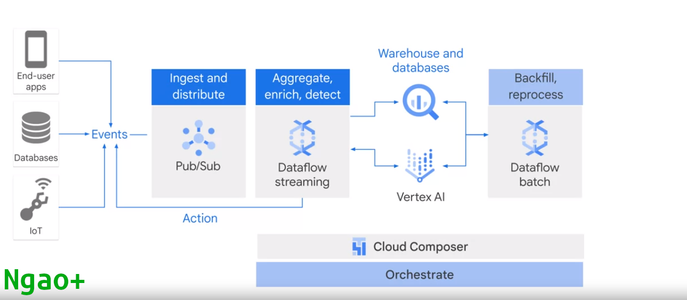
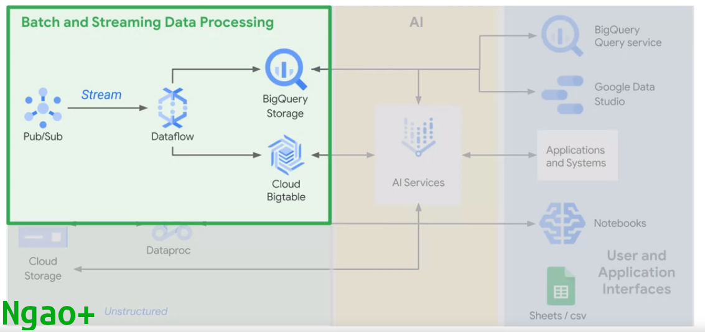

# Saina Project
### Leveraging Google Cloud's AI and data processing capabilities, saina enhances fraud detection in Square's payment ecosystem, making it more secure and reducing chargebacks for sellers.

#### Objective:Enable Sustainable Development Goal 9 --> Trade, Industry & Infrastructure --> Build resilient infrastructure, promote sustainable industrialization and foster innovation --> To provide affordable and reliable logistics services for SMEs in Africa.


## High-level diagram for AI-Enhanced Fraud Detection for Square's payment ecosystem                                                                                                            


# 1. Data Collection and Integration:
### Fullstack App Idea 

- *problem* Logistics account for more than 70% of a product price, how do we eliminate middlemen and increase profit for farmers, Artisans, Creators and SMEs?

- *solution* Enable Agro-trading spaces by creating a marketplace that links farmers with buyers all over Africa 


- Assumptions and prerequisites

This quick start guide makes the following assumptions:

* You have read the [In-App Payments SDK Overview]. This quick start focuses on getting
  the sample app installed and running to demonstrate how the In-App Payments SDK works.
* You have a Square account enabled for payment processing. If you have not
  enabled payment processing on your account (or you are not sure), visit
  [squareup.com/activate].
* You are familiar with basic React Native development.
* You have a GCP account with some credits.


Data is key, No AI projects beigins without data, so we gather transaction data from Square's payment ecosystem. This includes transaction details, customer information, and any other relevant information.Integrate data sources into the saina platform, making it accessible for analysis.

Basically, we implement a Secure Payment Flow in our fullstack,so that when a user proceeds to checkout, send a request to the server which is a VM in GCP to initiate a payment. This are the logs we are interested in in, we  actually use streaming to get real-time data warehouses and then create a dashboard of real-time information and notifications incase a fradulent activity is predictde by our AI model in real time..

We deploy our React Native app and Node.js server to Google clod platform environment, ensuring high availability and scalability. 

On the cloud is where the fun begins!


### Install the required tools

* Follow the **Building Projects with Native Code** instructions in the
[React Native Getting Started] guide to setup your React Native development
environment.
* Install `yarn` from [yarnpkg.com]
* Confirm your environment meets the In-App Payments SDK build requirements listed in the [root README] for this repo.
* Clone this repo (if you have not already):
  `git clone https://github.com/square/in-app-payments-react-native-plugin`

### Install dependencies for `react-native-in-app-payments-quickstart`

Change to the quick start sample folder and install the plugin using `yarn`:

  ```bash
  cd <YOUR_PROJECT_DIRECTORY>/react-native-in-app-payments-quickstart
  yarn
  ```

## Step 1: Get a Square Application ID and Location ID 

1. Sign in to your [Application Dashboard](https://connect.squareup.com/apps).
1. Click the **New Application** button on the **Applications** page
1. Give your application a name and then click the **Create Application** button.
1. On the **Credentials** page of the application control panel, copy the
   **Application ID**.
1. On the **Locations** page of the application control panel, copy the
   **Location ID** of one of your locations.


## Step 2: Configure the sample app
1. Open `<YOUR_PROJECT_DIRECTORY>/react-native-in-app-payments-quickstart/app/Constants.js`
1. On line 16, replace `REPLACE_ME` with the Application ID from **Step 1**
1. On line 20, replace `REPLACE_ME` with the Location ID from **Step 1**


## Step 3: Run the React Native sample app for iOS

Run the React Native project from the `react-native-in-app-payments-quickstart` project folder:

  ```bash
  cd /PATH/TO/LOCAL/react-native-in-app-payments-quickstart
  react-native run-ios
  ```

> **NOTE**: Make sure the folder `/PATH/TO/LOCAL/react-native-in-app-payments-quickstart/node_modules/react-native-square-in-app-payments/node_modules`
  is empty before you run `run-ios`.

## Step 4: Run the React Native sample app for Android

1. Open the Android project,
   `<YOUR_PROJECT_DIRECTORY>/react-native-in-app-payments-quickstart/android/` in Android Studio.
1. Confirm you have installed the required Android SDK. If you are
   unsure, the In-App Payments SDK build requirements are listed in the [root README] for this repo.
1. Configure and start an Android emulator that runs Android API 27 (Oreo, 8.0),
   or connect your dev machine to an Android device running Android API 27 with
   development mode enabled.
1. Run the React Native project from the `react-native-in-app-payments-quickstart`
   project folder:
    ```bash
    cd /PATH/TO/LOCAL/react-native-in-app-payments-quickstart
    react-native run-android
    ```

> **NOTE**: Make sure the folder `/PATH/TO/LOCAL/react-native-in-app-payments-quickstart/node_modules/react-native-square-in-app-payments/node_modules`
  is empty before you run `run-android`.

## Step 5: Use the nonce in a cURL payment command
Take a payment with the card nonce by executing the cURL command written into the debug output.
of your development environment. 

Update the cURL command by completing the following steps:

1. Replace the Location ID placeholder in the cURL query string with the 
location ID that you copied in **Step 1**.
1. Replace the access token placeholder with your access token. 
1. Run the cURL command to take a payment in your Square account.

>**Note:** We provide a cURL command in the debug output that you can use to easily test the payment with our [Payments API](https://developer.squareup.com/reference/square/payments-api). Your production app should use a secure backend service to make calls to the Payments API and should never expose your access token in the client.

You can view the [transaction details in Square Dashboard].

## Step 6: Optional - Use the nonce with the backend server

In a real app, you'd have a backend service running to process the payment and not be using curl commands.

Square provides a sample backend service for this quickstart that can easily be deployed to Heroku. Follow the steps in the [backend service setup guide] and choose 'Option 2: Use the Square Mobile Backend Quickstart URL'.

[//]: # "Link anchor definitions"
[In-App Payments SDK Overview]: https://developer.squareup.com/docs/in-app-payments-sdk/what-it-does
[squareup.com/activate]: https://squareup.com/activate
[React Native Getting Started]: https://facebook.github.io/react-native/docs/getting-started
[root README]: ../README.md
[transaction details in Square Dashboard]: https://squareup.com/dashboard/sales/transactions
[backend service setup guide]: take_a_payment.md

## Feedback
Rate this sample app [here](https://delighted.com/t/Z1xmKSqy)!

# Taking a payment with a Backend service

The In-App Payments Quick Start Sample React Native application generates a nonce and 
outputs a cURL command that posts the nonce to the Square Charge endpoint.

This article shows you how to modify the React Native sample app to use a  Node.js server app .


## Modify
To use the nonce to create a 1 dollar charge to be credited to your Square developer account, complete the next steps:

### Step 1: Get a backend payment processing URL   
You need access to a backend service that accepts the nonce from the app and then sends a POST request to the Square Charge endpoint.

### Step 2: Update sample process payments logic with a payment processing URL

1. Open the [app/Constants.js](./app/Constants.js) file.
1. On line 18, replace `CHARGE_SERVER_HOST` with the domain of the
deployed mobile backend quickstart app.


### Step 3: Run the sample app for iOS

Run the React Native project from the `react-native-in-app-payments-quickstart` project folder:

    ```bash
    cd /PATH/TO/LOCAL/react-native-in-app-payments-quickstart
    react-native run-ios
    ```

### Step 4: Run the sample app for Android

1. Configure and start an Android emulator that runs Android API 27 (Oreo, 8.0),
   or connect your dev machine to an Android device running Android API 27 with
   development mode enabled.
1. Run the React Native project from the `react-native-in-app-payments-quickstart` project folder:

    ```bash
    cd /PATH/TO/LOCAL/react-native-in-app-payments-quickstart
    $ react-native run-android
    ```


# 2. Data Ingestion

Used Google Cloud Pub/Sub to ingest the transaction data in real-time. This ensured that the data is continuously updated and available for analysis.                                                                                                          



#  3. Data Preprocessing
We clean and preprocess the data to remove inconsistencies and format it for analysis. Google Cloud Dataflow is used for data preprocessing to ensure data quality.

#  4. Machine Learning Model Development

 We build a machine learning model using Google AI Platform. We trained these models on historical transaction data to recognize patterns associated with fraudulent activities.

#  5. Real-time Analysis Utilize 
Google Cloud's real-time data analysis tool, Cloud Dataflow and Cloud Pub/Sub, analyzes incoming transaction data in real-time. We Implemented custom rules and machine learning model to identify potential fraud based on transaction patterns.

#  6. Alerting and Reporting 
We implemented an alerting system that triggers notifications when potential fraud is detected. Google Cloud Monitoring is used to set up alerting and Google Data Studio for creating real-time dashboards and reports.

#  7. Feedback Loop
We created a feedback loop to continuously improve the machine learning models, so we re-train models with new data and refine detection algorithms to adapt to evolving fraud tactics.

#  8. Incident Response
We developed a well-defined incident response plan to address confirmed fraud cases. Ensuring that actions are taken promptly to prevent further damage.

#  9. Compliance
We ensured compliance with relevant data protection and privacy regulations in all phases of data processing and analysis.

#  10. Testing and Validation
 Before we deploying the system in a live environment, we thoroughly test and validate its accuracy and efficiency in detecting fraudulent activities.

*Thank you for you interest in the project*